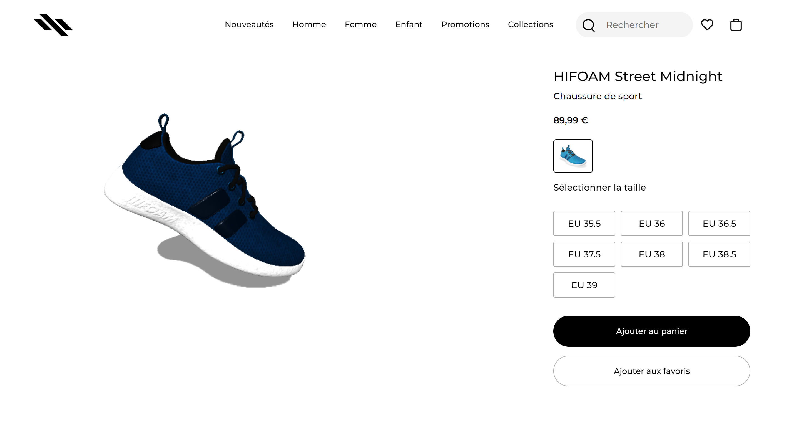

## Setup
Download [Node.js](https://nodejs.org/en/download/).
Run this followed commands:

``` bash
# Clone the repository
git clone https://github.com/J0SUKE/Hifoam.git

# Install dependencies (only the first time)
npm install

# Run the local server at localhost:8080
npm run dev

# Build for production in the dist/ directory
npm run build
```

<div id="top"></div>

<!-- PROJECT LOGO -->
<br />
<div align="center">
  
  <h3 align="center">HIFOAM - chaussures de sport</h3>

  <p align="center">
    Page d'un site de vente de chaussures utilisant Three JS 
    <br />
    <a href="https://hifoam.vercel.app/">voir la Demo</a>
  </p>
</div>

<!-- TABLE OF CONTENTS -->
<details>
  <summary>Sommaire</summary>
  <ol>
    <li>
      <a href="#about-the-project">À propos du projet</a>
      <ul>
        <li><a href="#built-with">Technologies utilisées</a></li>
      </ul>
    </li>
    <li><a href="#contact">Contact</a></li>
    <li><a href="#acknowledgments">Ressources</a></li>
  </ol>
</details>


<!-- ABOUT THE PROJECT -->
## À propos du projet



Ce mini projet est une page d'une boutique fictive de chaussures , l'interet est qu'il utilise un model 3D pour que le client se fasse un aperçu de la paire , pour cela j'ai eu recours à Three Js , il s'agit de mon premier projet avec cette librairie .

### Technologies utilisées

* [Tree JS](https://threejs.org/)
* [javascript](https://www.javascript.com/)
* [Sass](https://sass-lang.com/)

<!-- CONTACT -->
## Contact

* [twitter](https://twitter.com/Jean_M_____I)

* [Project Link](https://github.com/J0SUKE/Shoe-store)


<!-- ACKNOWLEDGMENTS -->
## Ressources

Voici quelques ressources qui m'ont servi lors de ce projet

* [Site web de Nike](https://www.nike.com/fr/t/chaussure-air-force-1-le-pour-plus-age-D59pRJ/DH2920-111)
* [Google fonts](https://fonts.google.com/)
* [icons8](https://icons8.com/icons/)
* [model3D](https://github.com/KhronosGroup/glTF-Sample-Models/tree/master/2.0/MaterialsVariantsShoe)
